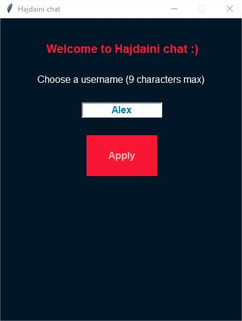
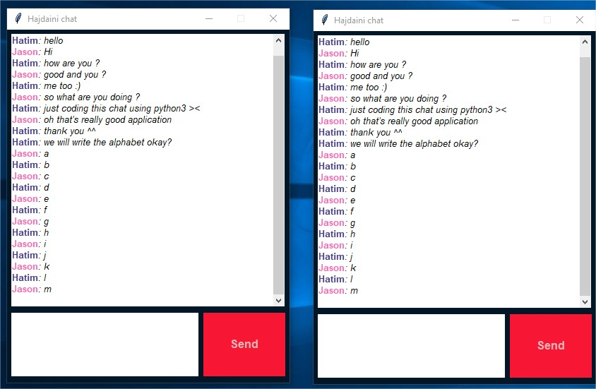

# Chat_Box

## Description : 
Instant messaging program with GUI written in python

## Prerequisites before running the script :
Install python 3 
 
## How it works :

1. **Hosting a server**

In order to create a discussion, one of parties need to host a server. For that, you just need to run the following command:
```py
pyhton3 server
```

2. **Join a server**

Wether you host a server or not, you need to connect to it to join a conversation. To join a server, simply run:
```py
pyhton3 client
```
3. **Choose your username**

Finally choose a username within the GUI and click **Apply** to join the server.
 <br /><br />

4. **Have fun!**
<br /><br />

5. **A log file named log.txt is also present. It tells you the different clients status.**
```
[2018-04-28 18:06:11] Jason (192.168.1.13:52059) is connected
[2018-04-28 18:06:28] Jason (192.168.1.13:52059) is disconnected
[2018-04-28 18:06:51] Hatim (192.168.1.13:52061) is connected
[2018-04-28 18:06:56] Jason (192.168.1.13:52062) is connected
[2018-04-28 18:06:12] Jason (192.168.1.13:52062) is disconnected
[2018-04-28 18:06:13] Hatim (192.168.1.13:52061) is disconnected
[2018-04-28 18:06:14] Alex (192.168.1.13:52083) is connected
[2018-04-28 18:06:17] Alex (192.168.1.13:52083) is disconnected
[2018-04-28 18:06:01] Sophia (192.168.1.13:52084) is connected
[2018-04-28 18:06:13] Mom (192.168.1.13:52085) is connected
[2018-04-28 18:06:16] Mom (192.168.1.13:52085) is disconnected
[2018-04-28 18:06:17] Sophia (192.168.1.13:52084) is disconnected
```
