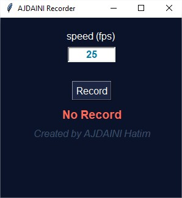

# screen-record-with-gui-interface

## Description :

Screen record with tkinter with gui interface



## Prerequisites before running the script :

 1. Install python 3 
 2. Install PIL, opencv, pyscreenshot and numpy

	```shell
	 sudo apt-get -y install python3-pip
 	 pip3 install opencv-python pillow pyscreenshot numpy
	```

## How to use it :

```py
python3 record_screen.py
```

when finish recording then check the output.avi in the current directory
